# GUINDO BADARA ALIOU
# MSDIA
# 2100000017

# Création d'un projet Java Maven simple

Ce projet illustre une architecture multi-modules basée sur **Spring Boot** et **Spring AI MCP**, incluant :
- un module serveur Spring,
- un module client Spring,
- un module Python,
- une communication inter-composants via le protocole MCP (Model Coordination Protocol).

Les captures ci-dessous détaillent la structure du projet, les composants, la configuration et la communication avec le serveur MCP.

---

## Structure du projet

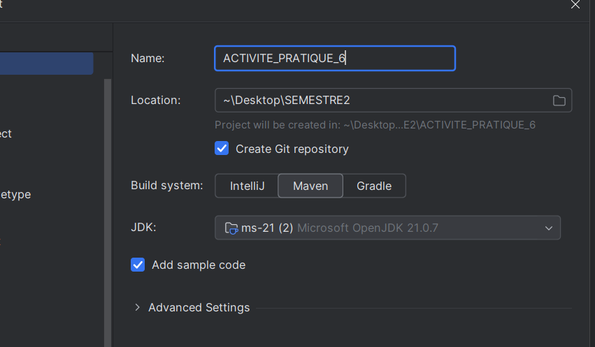

---

## Module serveur

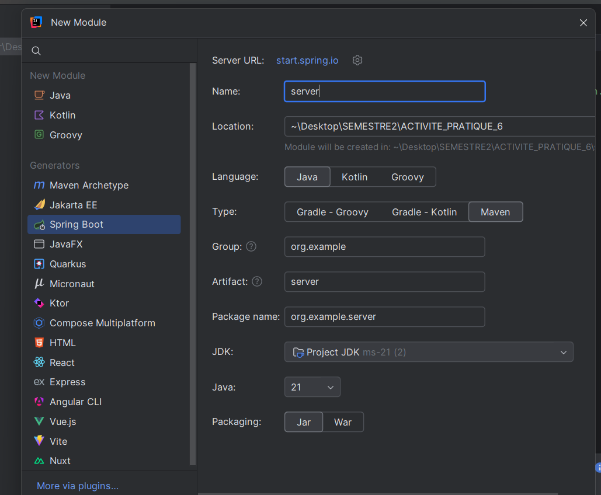  
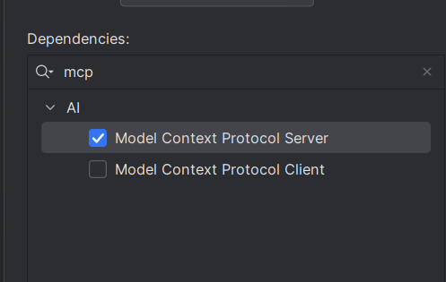

---

## Module client

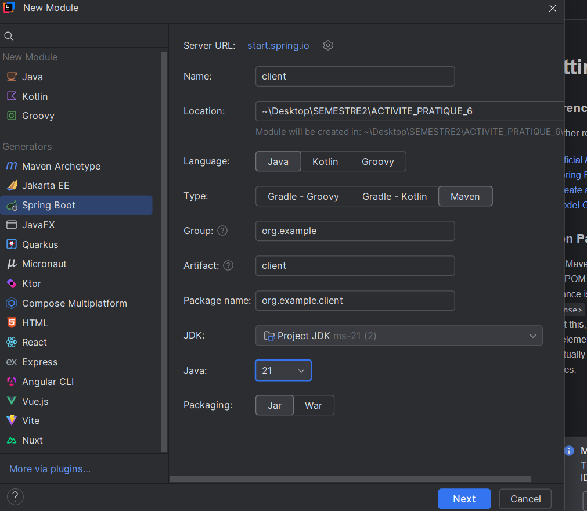

---

## Module Python

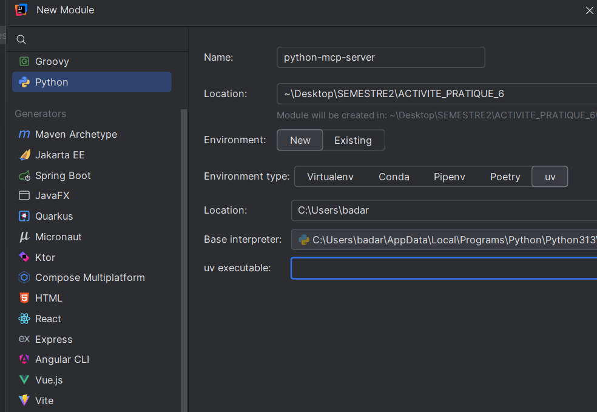

---

## Classe `StockTools` (Service métier)

Dans cette classe `StockTools`, un service Spring (`@Service`) expose des outils métiers annotés avec `@Tool` de Spring AI.  
Ce service gère une liste statique d'entreprises marocaines représentées par des objets `Company`.

Trois méthodes principales sont exposées :
- `getAllCompanies()` : récupère toutes les entreprises,
- `getCompanyByName(String name)` : recherche une entreprise par nom,
- `getStockByCompanyName(String name)` : simule le cours de bourse d'une entreprise.

Deux `record` Java sont utilisés :
- `Company` : pour représenter une entreprise,
- `Stock` : pour représenter un cours de bourse.

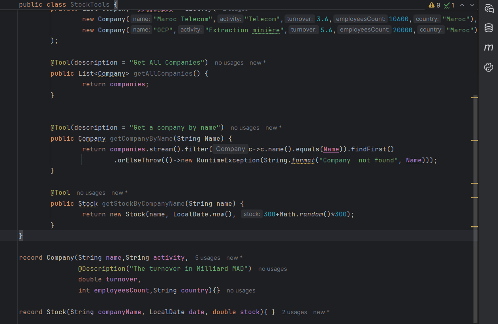

---

## Configuration du serveur MCP

L'application utilise Spring AI MCP (Model Coordination Protocol) pour permettre une interaction synchrone (`type=sync`) entre agents IA et outils métier.

Deux endpoints sont exposés :
- `/sse` pour les événements SSE (Server-Sent Events),
- `/mcp/message` pour les messages JSON-RPC.

Configuration :
- Port : `8870`
- Version MCP : `1.0.0`
- Nom du serveur MCP : `spring-mcp-server`

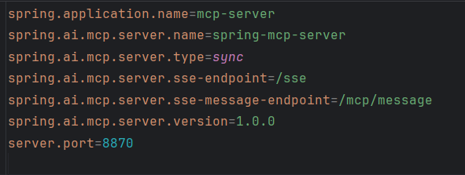

---

## Initialisation de session MCP (client)

Initialisation d’une session via `JSON-RPC 2.0` avec la méthode `initialize`.  
Le client spécifie la version du protocole et les capacités supportées (comme `roots.listChanged`).  
Réponse du serveur : `200 OK`.

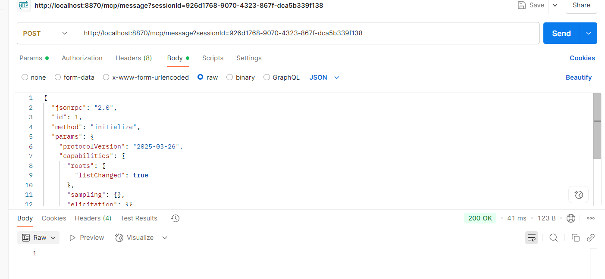

---

## Notification d'initialisation

Après `initialize`, le client envoie `notifications/initialized` pour indiquer qu’il est prêt.

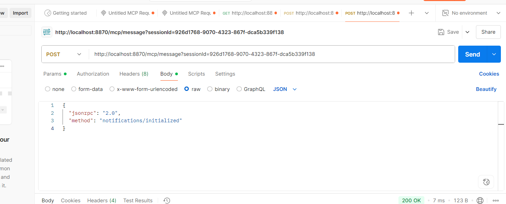

---

## Récupération des outils (`tools/list`)

Requête envoyée par le client pour obtenir dynamiquement la liste des outils disponibles sur le serveur.  
Réponse attendue : noms, descriptions et schémas d’entrée.

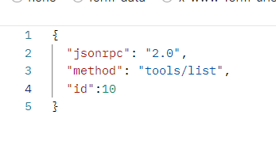

---

## Appel d'un outil (`tools/call`)

Appel de l’outil `getCompanyByName` avec l’argument `{ "name": "OCP" }` pour obtenir les informations de l’entreprise.

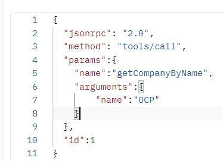

---

## Résultat de l’appel

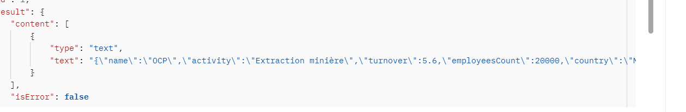

---

## Configuration du client `mcp-client`

Le fichier `application.properties` configure le client MCP Spring pour se connecter à :
- URL : `http://localhost:8870`
- Point d’accès SSE : `/sse`
- Modèle IA utilisé : `claude-sonnet-4-20250514` via Anthropic
- Clé API : `${CLAUDE_API_KEY}` (sécurisée)

Ce client permet de dialoguer dynamiquement avec le serveur intelligent.

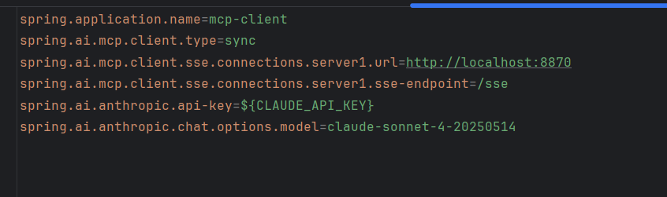
